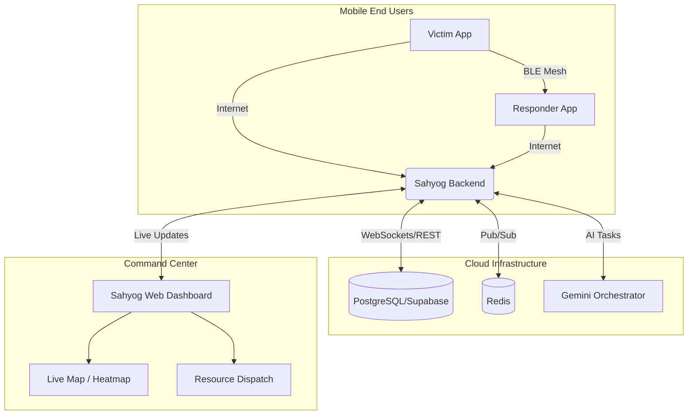
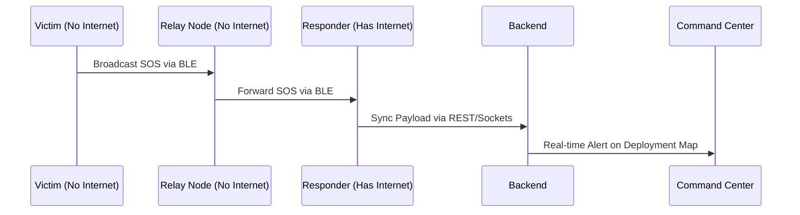

# Sahyog: Decentralized Disaster Management & Relief Platform

Sahyog is a comprehensive disaster management ecosystem designed to facilitate rapid emergency response, resource coordination, and offline communication during critical infrastructure failures. 

## 🏗️ Project Architecture

The Sahyog monorepo consists of three core components:

1. **`sahyog` (Backend)**: The central Node.js/Express server that manages real-time socket connections, PostgreSQL database (via Supabase), AI orchestration (Gemini), and REST APIs.
2. **`sahyog-web` (Frontend)**: A React-based web dashboard for Command Centers, Relief Organizations, and Volunteers to view real-time heatmaps, dispatch resources, and manage SOS alerts.
3. **`sahyog-app` (Mobile)**: A Flutter mobile application designed for end-users and on-ground responders. It features a BLE-based Mesh Network for offline SOS transmission.

---

## 📡 System Flow & Architecture

### 1. Overall System Architecture


### 2. Offline Mesh Network Flow (BLE)
In the event of cellular network failure, the mobile app utilizes Google Nearby Connections (P2P_STAR) to form an offline mesh network.


---

## 🚀 Getting Started

### Prerequisites
- Node.js v18+
- Flutter SDK (latest stable)
- PostgreSQL (or Supabase account)
- Redis Server

### 1. Backend Setup (`/sahyog`)
```bash
cd sahyog
npm install
# Configure your .env (Supabase, Redis, Gemini API, Clerk)
npm run dev
```

### 2. Web Dashboard Setup (`/sahyog-web`)
```bash
cd sahyog-web
npm install
# Configure your .env (Vite API URL, Clerk Publishable Key)
npm run dev
```

### 3. Mobile App Setup (`/sahyog-app`)
```bash
cd sahyog-app
flutter pub get
# Update lib/src/core/app_config.dart with your backend IP
flutter run
```

---

## 🛠️ Tech Stack
- **Mobile**: Flutter, Google Nearby Connections API, SQFlite (Offline Storage).
- **Web Frontend**: React, Vite, TailwindCSS, React-Leaflet (Maps), Clerk (Auth).
- **Backend Core**: Node.js, Express, Socket.io.
- **Database & Cache**: PostgreSQL (Supabase), Redis.
- **AI Integration**: Google Gemini API for resource allocation and impact assessment.

---

## 📄 Documentation & Resources
- Complete documentation is available in the `docs/` folder, including API structures and Postman collections.
- Database seeds and sample schemas can be found in `sahyog/migrations/`.
- For mock data generation, reference the `data/README.md` file.